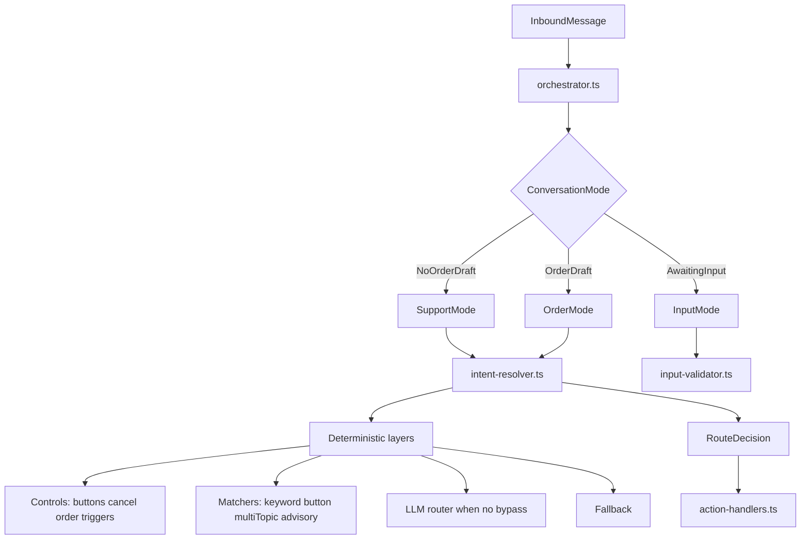

# Phase 1 design interview

Reusable prompt for walking the **Confiance Tech WhatsApp bot** (`confiance_chatbot`) design tree until decisions are shared and documented. Scope is the chatbot service and its store integration, not Holdam escrow core or on-chain lifecycle.

**Target architecture:** single intent-resolution pipeline (see routing refactor plan). Interview both **current live behavior** and **agreed target modules** so docs and code converge.

## Quick copy

Paste this into a new chat:

```
Interview me relentlessly about every aspect of the Confiance Tech WhatsApp bot (current live MVP + agreed routing refactor) until we reach a shared understanding.

Walk down each branch of the design tree, resolving dependencies between decisions one by one.

Update documentation as we go. Create new docs under confiance_chatbot/docs/ when a topic needs its own spec.

Read first (in order):
1. confiance_chatbot/README.md
2. confiance_chatbot/docs/SYSTEM_DESIGN.md
3. confiance_chatbot/docs/BOT_FLOWS.md
4. confiance_chatbot/docs/tests/acceptance-criteria/chatbot.md
5. confiance_chatbot/docs/WHATSAPP_SETUP.md
6. confiance_chatbot/docs/tests/README.md and bot-improvement-workflow.md
7. confiance-tech-ecom/app/api/create-holdam-deal/route.ts and app/api/bot/catalog (store contracts the bot calls)

Use this dependency order when choosing what to decide next:
1. Routing invariants and hybrid policy (INV-ROUTE-*, keyword + LLM + fallback, not LLM-only)
2. Conversation modes and RouteDecision shape (SupportMode, OrderMode, InputMode)
3. Intent resolver layer precedence (controls → structured input → matchers → LLM → fallback)
4. Session model (Redis keys, dedupe, lock, orderDraft preservation, 24h TTL)
5. Declarative support flow (confiance-tech-main.ts nodes, intents, buttons, handoff)
6. Imperative order flow (orderDraft steps, collector, catalog validation, confirm)
7. Store integration (GET /api/bot/catalog, POST /api/create-holdam-deal; bot never calls Holdam directly)
8. LLM router (tools, confidence gate, skip rules, mid-order context)
9. WhatsApp platform (webhook verify, HMAC, outbound types, fast ACK)
10. Security and commerce safety (no LLM prices/deals; buyer-safe checkout errors)
11. Eval and test harness (Pass 1/2, headless agent, traced Vitest suites)
12. Ops and env pairing (CONFIANCE_STORE_URL, store HOLDAM_API_KEY alignment)
13. BDD alignment (docs/tests/acceptance-criteria/chatbot.md)
14. Exit criteria (eval thresholds, critical journeys green)
15. Explicit deferrals (vision on images, LLM-only routing, declarative order flow)

At each decision:
- State what is being decided and what it depends on
- Ask one focused question at a time; push back if an answer conflicts with INV-ROUTE-07 (hybrid routing) or INV-COMMERCE-*
- Record the decision in the right doc (SYSTEM_DESIGN.md, BOT_FLOWS.md, or a new docs/*.md subdoc)
- Track resolved vs open questions in a short open-questions section at the bottom of SYSTEM_DESIGN.md or a dedicated docs/open-questions.md
- Defer out-of-scope items explicitly with a link (do not blur live MVP vs roadmap)
- Do not implement code until we agree on the design for that branch (unless I say otherwise)

When behavior is agreed, update confiance_chatbot/docs/tests/acceptance-criteria/chatbot.md and traced tests in confiance_chatbot/tests/ (cite // BDD: chatbot.md › …).

Follow project copy style: no em dashes or en dashes in user-facing text.

Routing refactor context (authoritative target):
- One intent-resolver.ts pipeline; orchestrator picks mode only
- route-decision.ts types shared by resolver, action-handlers, telemetry
- Deprecate split-brain inbound-router.ts + support-signal.ts duplicate detectors
- Mid-order support: preserve orderDraft + resume banner in one place (action-handlers.ts)
```

## Design tree (reference)

Use this map to ensure no branch is skipped:

| Branch | Primary doc |
|--------|-------------|
| Purpose, context, containers | [SYSTEM_DESIGN.md](../../confiance_chatbot/docs/SYSTEM_DESIGN.md) §1–3 |
| Inbound pipeline and orchestrator | [SYSTEM_DESIGN.md](../../confiance_chatbot/docs/SYSTEM_DESIGN.md) §5 |
| Conversation models (support, order, LLM) | [SYSTEM_DESIGN.md](../../confiance_chatbot/docs/SYSTEM_DESIGN.md) §6 |
| Session and Redis keys | [SYSTEM_DESIGN.md](../../confiance_chatbot/docs/SYSTEM_DESIGN.md) §7 |
| Store and Meta API contracts | [SYSTEM_DESIGN.md](../../confiance_chatbot/docs/SYSTEM_DESIGN.md) §8 |
| Security | [SYSTEM_DESIGN.md](../../confiance_chatbot/docs/SYSTEM_DESIGN.md) §9 |
| Routing paths and button IDs | [BOT_FLOWS.md](../../confiance_chatbot/docs/BOT_FLOWS.md) |
| Support flow content (source of truth) | `confiance_chatbot/src/flows/confiance-tech-main.ts` |
| Live order state machine | `confiance_chatbot/src/orders/order-flow.ts` |
| **Target:** intent resolver and RouteDecision | `confiance_chatbot/src/routing/intent-resolver.ts`, `route-decision.ts` (planned) |
| **Target:** matcher modules | `confiance_chatbot/src/routing/matchers/` (planned) |
| **Target:** action execution (no matching) | `confiance_chatbot/src/routing/action-handlers.ts` (planned) |
| WhatsApp ops and env | [WHATSAPP_SETUP.md](../../confiance_chatbot/docs/WHATSAPP_SETUP.md) |
| Store catalog API | `confiance-tech-ecom/app/api/bot/catalog` |
| Store deal creation | `confiance-tech-ecom/app/api/create-holdam-deal/route.ts` |
| Global routing invariants | [chatbot.md](../../confiance_chatbot/docs/tests/acceptance-criteria/chatbot.md) (INV-*) |
| Eval workflow and thresholds | [bot-improvement-workflow.md](../../confiance_chatbot/docs/tests/bot-improvement-workflow.md) |
| Executable tests | `confiance_chatbot/tests/**/*.test.ts` |

## Routing architecture (target state)

Replace split-brain routing with **one resolver, three modes**:



### RouteDecision (shared output)

```typescript
type RouteDecision =
  | { kind: "order_control"; handler: "cancel" | "resume" | "slot" | "confirm" }
  | { kind: "support"; nodeId: string; source: "button" | "keyword" | "advisory" | "llm" | "fallback" }
  | { kind: "order_start" }
  | { kind: "llm_tool"; tool: LlmToolName; confidence: number }
  | { kind: "clarify" | "fallback" | "noop" };
```

### Resolver layer order (authoritative)

Document once, test once:

1. **Hard controls** — `order_*` buttons, `cancel`, exact order triggers (no draft)
2. **Structured input** — `awaitingInput` validation (no LLM)
3. **Deterministic matchers** — button, keyword (≥ 0.85), mid-order advisory, multi-topic, handoff, malicious, menu
4. **LLM router** — only if `shouldUseLlm()` and no bypass; mid-order context includes `orderDraftSummary`
5. **Fallback** — weak keyword → main menu + copy

**Mid-order rule:** when `orderDraft` exists and decision is `support`, always preserve draft + send resume banner in `action-handlers.ts` (one place, not scattered branches).

### Known pain (current → target)

| Pain | Fix in refactor |
|------|-----------------|
| Duplicate detectors in `support-signal.ts` and `inbound-router.ts` | Single matcher pipeline in `intent-resolver.ts` |
| Mid-order FAQ stuck on slot picker | Advisory matchers before slot collection; unified mid-order escape |
| God module `inbound-router.ts` | Split: resolver (match) + action-handlers (act) |
| Misleading eval telemetry | Log `RouteDecision` separately from `orderDraft.step` |

## Implementation phases (code refactor)

Align interview decisions with these delivery phases:

| Phase | Goal | Exit criteria |
|-------|------|---------------|
| **1 — Unify resolution** | Fix split brain without changing buyer-visible behavior | `route-decision.ts` + `intent-resolver.ts` + `action-handlers.ts`; all existing tests green; eval M-001, S-005, S-006 pass |
| **2 — Order mode clarity** | Slot vs FAQ classifier; buyer-safe checkout errors | Friendly copy for `Key not found` / inactive API key; WHATSAPP_SETUP ops checklist; BDD row in chatbot.md |
| **3 — Observability** | Debuggable routing in dev and eval | `conversation-log` logs RouteDecision; eval uses `decision.source` + layer; delete deprecated shims |

**Separate from routing:** terminal `Key not found` on confirm is a **store env mismatch** (`HOLDAM_API_KEY` in confiance-tech-ecom vs escrow-service `api_keys`). Fix env first; improve buyer copy in Phase 2.

## Exit criteria (north star)

From [bot-improvement-workflow.md](../../confiance_chatbot/docs/tests/bot-improvement-workflow.md) and [chatbot.md](../../confiance_chatbot/docs/tests/acceptance-criteria/chatbot.md):

- End-to-end in chat: welcome → FAQ or order → slot fill → confirm → Holdam checkout URL
- Every inbound message yields a reply (`INV-RESP-01`); webhook fast ACK (`INV-RESP-02`)
- Hybrid routing preserved: keywords, buttons, and fallbacks work with LLM off (`INV-ROUTE-07`, `INV-FALLBACK-03`)
- Mid-order support detour preserves `orderDraft` and shows resume banner (`INV-ROUTE-05`)
- Prices and checkout URLs from store APIs only (`INV-COMMERCE-*`)
- Pass 1 + Pass 2 eval meet release thresholds on blind cases
- Critical Vitest suites green: `mid-order-routing`, `invariants-intents`, `support-orchestrator`, webhook integration
- Doc cascade complete for resolver modules (SYSTEM_DESIGN §3 container + resolver section, BOT_FLOWS routing diagram)

## Routing boundaries (check every decision)

- **Hybrid, not LLM-only:** deterministic layers first; LLM for ambiguity only (`INV-ROUTE-07`)
- **Commerce safety:** LLM picks tools; never invents prices, deal IDs, or checkout URLs
- **Bot → store → Holdam:** bot never holds `HOLDAM_API_KEY`; deal creation via store route only
- **Mid-order:** support detours never clear `orderDraft` unless cancel, confirm success, or explicit start over
- **Session integrity:** dedupe by `messageId`; per-phone lock; 24h TTL
- **Honest copy:** checkout failures show buyer-safe messages; raw API errors stay server-side
- **Single resolver:** no parallel `detectSupportSignal` + `matchIntentDetailed` paths after Phase 1

## Explicit non-goals (do not implement unless scoped)

| Topic | Reason |
|-------|--------|
| LLM-only routing | Contradicts INV-ROUTE-07 and production reliability |
| Merge order flow into declarative flow JSON | Order stays imperative with catalog validation |
| LLM-generated checkout URLs or prices | Commerce stays API-driven |
| Bot calling Holdam directly | INV-COMMERCE-02 |
| Image vision / media understanding | Deferred; static hint today |
| Multi-language beyond `en-NG` | Deferred |

## Doc cascade (when behavior or architecture changes)

| Change | Update |
|--------|--------|
| New resolver modules | SYSTEM_DESIGN.md §3 container + resolver section |
| Layer precedence | BOT_FLOWS.md routing diagram |
| Mid-order + checkout errors | chatbot.md acceptance criteria |
| Eval layer mapping | eval-scoring-key.json `routingPolicy` |
| Store API contract | SYSTEM_DESIGN.md §8 + confiance-tech-ecom route handlers |
| Ops env pairing | WHATSAPP_SETUP.md |

## Related prompts

| Goal | Where to start |
|------|----------------|
| Audit codebase vs design (live paths) | Read SYSTEM_DESIGN.md + trace `orchestrator.ts` → resolver/handlers |
| Run eval improvement loop | [bot-improvement-workflow.md](../../confiance_chatbot/docs/tests/bot-improvement-workflow.md) |
| Add BDD scenario | [chatbot.md](../../confiance_chatbot/docs/tests/acceptance-criteria/chatbot.md) + `tests/` with `// BDD:` cite |
| Store deal creation debugging | WHATSAPP_SETUP.md + create-holdam-deal route + escrow-service api_keys |
| Holdam escrow Phase 1 (separate product) | escrow monorepo `docs/.cursor/prompts/phase-1-implementation-design-interview.md` |
